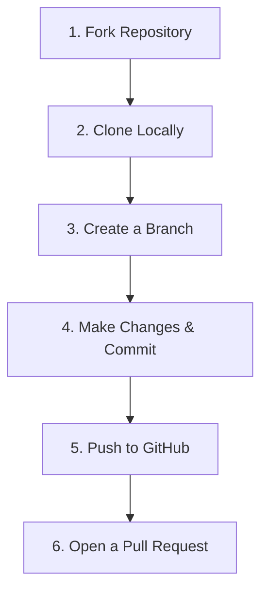

# 💻 Git & GitHub Basics

Learn how to contribute to open-source projects using Git and GitHub! This guide covers the basic workflow you will use to make contributions at Crystal Studio. 🚀

---

## 🔄 The Open Source Workflow



### 1️⃣ Step 1: Fork the Repository
Click the **Fork** button in the top-right corner of any project repository (for example, our [opensource-playground](https://github.com/Crystal-Studio-Community/opensource-playground)). This creates a copy of the repository under your own GitHub account.

### 2️⃣ Step 2: Clone it Locally
Open your terminal and clone your forked repository to your local computer:
```bash
git clone https://github.com/YOUR-USERNAME/repository-name.git
```

### 3️⃣ Step 3: Create a Branch
Create a new branch for the feature or bug fix you are working on. Keep the branch name short and descriptive:
```bash
git checkout -b feature/my-new-feature
```

### 4️⃣ Step 4: Commit your changes
Once you've made your edits, stage the files and commit them with a clean message:
```bash
git add .
git commit -m "feat: add my amazing new feature 🎨"
```

### 5️⃣ Step 5: Push to GitHub
Push your local branch to your repository on GitHub:
```bash
git push origin feature/my-new-feature
```

### 6️⃣ Step 6: Create a Pull Request (PR)
Go back to the original repository on GitHub. You will see a banner suggesting you to **Compare & pull request**. Click it, explain your changes, and submit!

---

💡 **Tip:** Always pull the latest changes from the parent repository (`main` branch) before creating a new branch to prevent merge conflicts!
